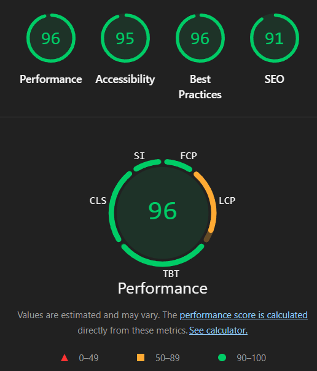
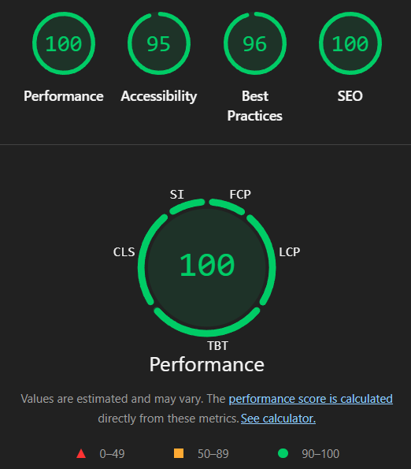

# Projet Tailwindcss - Audit Lighthouse

## Contexte
Ce projet a fait l'objet d'un audit Lighthouse sur les points Accessibilité, Best Practices et SEO. Les corrections appliquées ci-dessous ciblent les problèmes détectés par l'audit.

## Présentation
Ce livrable présente un parcours clair et argumenté, depuis l'identification des faiblesses via Lighthouse jusqu'aux corrections appliquées. La démarche met l'accent sur la lisibilité, l'accessibilité et la robustesse technique, avec des choix justifiés et des impacts visibles. L'objectif est de démontrer une exécution maîtrisée, qui transforme des constats en améliorations concrètes, tout en préservant l'expérience utilisateur et la cohérence visuelle du projet.

## Comment lancer le projet avec Go Live

### Prérequis
- Visual Studio Code
- Extension "Live Server" (auteur: Ritwick Dey)

### Étapes
1. Ouvre le dossier du projet dans VS Code.
2. Installe l'extension "Live Server" si besoin.
3. Ouvre index.html.
4. Clique sur le bouton "Go Live" en bas à droite de VS Code.
5. Le site s'ouvre automatiquement dans ton navigateur.

## Arborescence
- index.html
- styles.css
- script.js
- responses.json
- images/

## Texte explicatif - Avant l'audit (points négatifs)
Avant correction, l'audit Lighthouse indiquait plusieurs faiblesses. Côté SEO, la page manquait d'une meta description et d'un titre principal clair, ce qui limite la compréhension du contenu par les moteurs. Côté accessibilité, un rôle ARIA incompatible et un contraste insuffisant sur le widget de zoom pouvaient nuire à la lisibilité et à l'usage avec des technologies d'assistance. Enfin, des erreurs JavaScript apparaissaient dans la console à cause de références à des éléments inexistants, et les images n'étaient pas déclarées en lazy loading, ce qui impacte l'expérience et les bonnes pratiques.

## Texte explicatif - Après l'audit (corrections apportées)
Après intervention, la page dispose d'une méta description et d'un H1 visible pour renforcer le SEO. Le rôle ARIA incompatible a été retiré tout en conservant l'aria-label, et les couleurs du widget de zoom ont été assombries pour un meilleur contraste. Les erreurs console ont été éliminées en supprimant le code JS inutile, et les images ont été déclarées avec loading="lazy", decoding="async" et des dimensions fixes pour stabiliser l'affichage. Ces changements rendent l'interface plus accessible, plus propre et plus conforme aux bonnes pratiques.

## Optimisations LCP appliquées
L'image principale est désormais priorisée pour accélérer le Largest Contentful Paint. Un preload a été ajouté dans le head et l'image est chargée en eager avec fetchpriority="high" afin d'être rendue le plus tôt possible. Ces ajustements expliquent l'amélioration du LCP dans les mesures Lighthouse.

## Indicateurs Core Web Vitals
Les Core Web Vitals mesurent la qualité d'expérience perçue par l'utilisateur.

- LCP (Largest Contentful Paint) : temps d'affichage du plus grand élément visible. Objectif : 2,5 s ou moins.
- FID (First Input Delay) : délai entre la première interaction et la réponse du navigateur. Objectif : 100 ms ou moins. (Sur Lighthouse récent, FID est remplacé par INP.)
- CLS (Cumulative Layout Shift) : stabilité visuelle, mesure des décalages inattendus. Objectif : 0,1 ou moins.

## Valeurs actuelles (Lighthouse)
- First Contentful Paint (FCP) : 0,5 s
- Largest Contentful Paint (LCP) : 0,6 s
- Total Blocking Time (TBT) : 70 ms
- Cumulative Layout Shift (CLS) : 0
- Speed Index : 0,9 s

## Notes
Les points de sécurité (CSP, HSTS, COOP, XFO, Trusted Types) sont des en-têtes serveur et ne peuvent pas être corrigés uniquement dans le front. Il est également à noté que la notion de CSS minify ne nous a pas été transmises. Ce principe n'a donc pas pu être appliqué.
